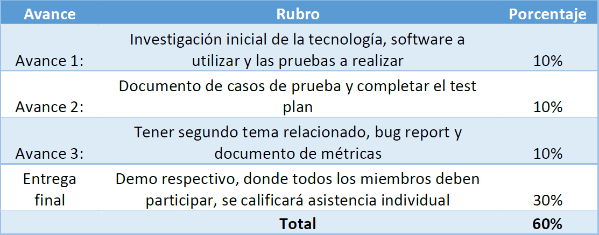

# Proyecto de Calidad de software 
El documento con toda la informacion sobre los requisitos del proyecto es: Proyecto_Final\SC405_Proyecto Final_2021_IIC.pdf

## Avances fechas

### Avance 1
- [x] Investigacion inicial de la tecnologia
- [x] Software a utilizar para realizar las pruebas
- [x] Las pruebas a realizar
- [x] Descripcion del software a probar

### Avance 2
- [ ] Documento de casos de prueba (12 tests)
  - [ ] Utilizar la plantilla de casos hecha en Latex que va a brindar Jonathan
  - [ ] Tests 1-4 [Morales]
  - [ ] Tests 5-8 [Daniel]
  - [ ] Tests 9-12 [Edmond]
- [ ] Completar el test plan [Jonathan]
  - [ ] Reunion para completarlo

### Avance 3
- [ ] Tener segundo tema relacionado (???)
- [ ] Bug Report
- [ ] Documento de metricas

### Entrega Final
- [ ] Demo 

## Glosario de palabras clave del proyecto
- Plan de Pruebas: 
  
  De acuerdo con el software seleccionado, elegir cuales pruebas pueden ser ejecutadas e indicarlo en los casos de prueba:
- Casos de pruebas:
  
  Utilizando técnicas de diseño vistas en clase
- Ejecución
  
  En un aplicativo real escogido por el grupo para realizar la ejecución:
- Bug Report
  
  Definir la estructura básica del defecto y ponerlos en evidencia con el formato de defectos establecido.
- Definición de Métricas:
  
  Establecer las métricas necesarias para la ejecución del proyecto
